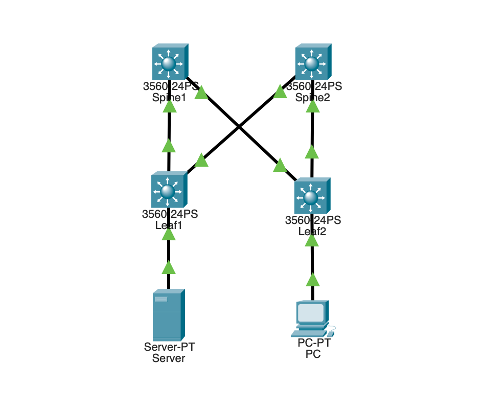
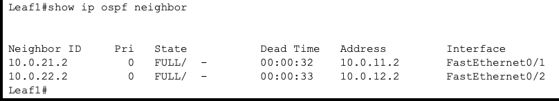
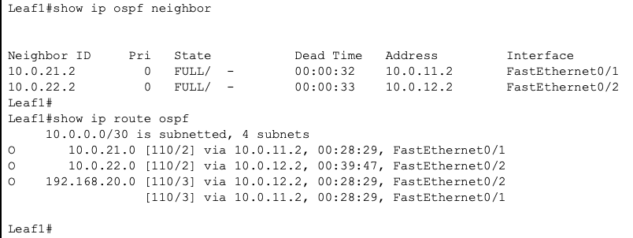
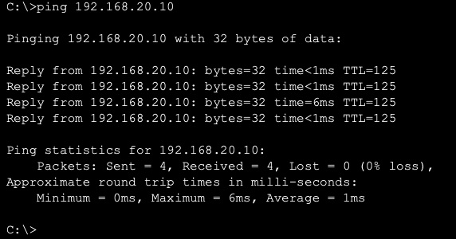
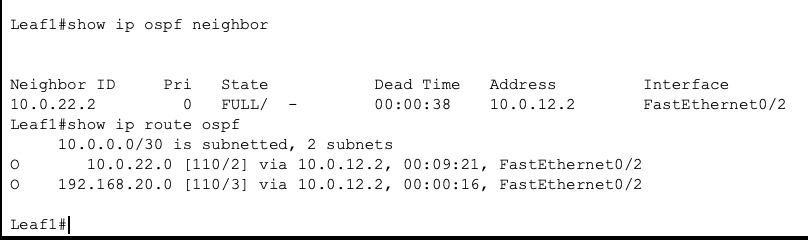
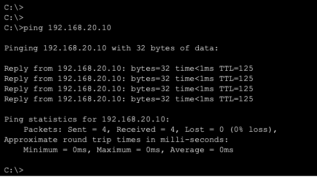
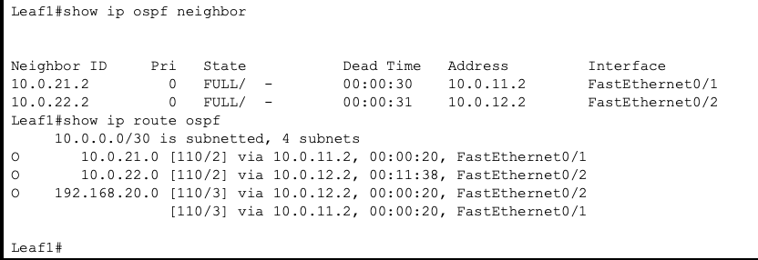

# Leaf-Spine OSPF ネットワーク構築ハンズオン

Cisco Packet Tracerを使用して、2台のSpineスイッチと2台のLeafスイッチによるLeaf-Spineネットワークを構築しました。

Leaf-Spine間をLayer3 Point-to-Pointリンクとして構成し、OSPF Area 0による動的ルーティングを実装しています。

また、Spine1・Spine2を利用したECMP（Equal-Cost Multi-Path）を確認し、Spine1のLeaf向けリンク停止時にSpine2経由へ経路が切り替わり、障害収束後もEnd-to-End疎通が可能であることを検証しました。

## ネットワーク構成



### 構成概要

- Spineスイッチ：2台
- Leafスイッチ：2台
- OSPF Process ID：1
- OSPF Area：0
- Leaf-Spine間：Layer3 Point-to-Point
- Leaf1配下：VLAN10 / 192.168.10.0/24
- Leaf2配下：VLAN20 / 192.168.20.0/24

## IPアドレス設計

| 接続 | ネットワーク | Leaf側 | Spine側 |
|---|---|---|---|
| Leaf1 - Spine1 | 10.0.11.0/30 | 10.0.11.1 | 10.0.11.2 |
| Leaf1 - Spine2 | 10.0.12.0/30 | 10.0.12.1 | 10.0.12.2 |
| Leaf2 - Spine1 | 10.0.21.0/30 | 10.0.21.1 | 10.0.21.2 |
| Leaf2 - Spine2 | 10.0.22.0/30 | 10.0.22.1 | 10.0.22.2 |

### LAN

| セグメント | ネットワーク | デフォルトゲートウェイ |
|---|---|---|
| Leaf1側 | 192.168.10.0/24 | 192.168.10.1 |
| Leaf2側 | 192.168.20.0/24 | 192.168.20.1 |

## 実装内容

- Leaf-Spineトポロジ
- Layer3 Routed Port
- OSPF Area 0
- OSPF Point-to-Point Network Type
- Passive InterfaceによるOSPF Hello送信抑止
- OSPF Neighbor確立
- ECMPによる複数経路
- VLAN10 / VLAN20
- SVIによるデフォルトゲートウェイ
- End-to-End疎通確認
- Spine1 Leaf向けリンク障害試験
- OSPF経路切り替え確認
- 障害収束後のEnd-to-End疎通確認
- 復旧後のECMP再形成確認

## OSPF / ECMP確認

正常時はLeaf1からLeaf2配下の `192.168.20.0/24` に対し、Spine1・Spine2を経由する2つの等コスト経路がルーティングテーブルに登録されることを確認しました。

```text
O 192.168.20.0 [110/3] via 10.0.11.2, FastEthernet0/1
                [110/3] via 10.0.12.2, FastEthernet0/2
```

Leaf2からLeaf1配下の `192.168.10.0/24` に対しても、同様に2経路が登録されることを確認しています。

## 障害試験

Spine1のLeaf向けインターフェースを停止し、Spine1を経由できない状態を作成しました。

障害発生後、Leaf1ではSpine1とのOSPF Neighborが消失し、Leaf2配下への経路がSpine2経由の1経路に切り替わることを確認しました。

```text
O 192.168.20.0 [110/3] via 10.0.12.2, FastEthernet0/2
```

この状態でもServerからPCへのPingが成功し、Spine1のLeaf向けリンク停止後、OSPF収束後もEnd-to-End疎通が可能であることを確認しました。

Spine1復旧後はOSPF Neighborが再確立され、再び2つの等コスト経路に戻ることも確認しました。

## 詳細資料

- [ネットワーク設計書](docs/network-design.md)
- [パラメータシート](docs/parameter-sheet.md)
- [試験結果](docs/test-results.md)
- [Packet Tracerファイル](packet-tracer/leaf-spine-ospf.pkt)

## Config

- [Spine1](configs/Spine1.txt)
- [Spine2](configs/Spine2.txt)
- [Leaf1](configs/Leaf1.txt)
- [Leaf2](configs/Leaf2.txt)

## 使用環境

- Cisco Packet Tracer
- Cisco Multilayer Switch
- OSPF
- IPv4
- VLAN
- SVI

## 学習・検証内容

本ハンズオンでは、OSPFの設定だけでなく、ルーティングテーブルやNeighbor状態を確認しながら、冗長経路がどのように形成されるかを検証しました。

また、Spine1のLeaf向けリンクを停止し、OSPFによる経路切り替え後の疎通と、復旧後のECMP再形成まで確認することで、冗長ネットワークにおける障害時の動作について理解を深めました。

## 検証Evidence

### OSPF Neighbor



### ECMP



### End-to-End疎通



### Spine1 Leaf向けリンク障害時の経路切り替え



### 障害収束後の疎通確認



### 復旧後のECMP再形成


